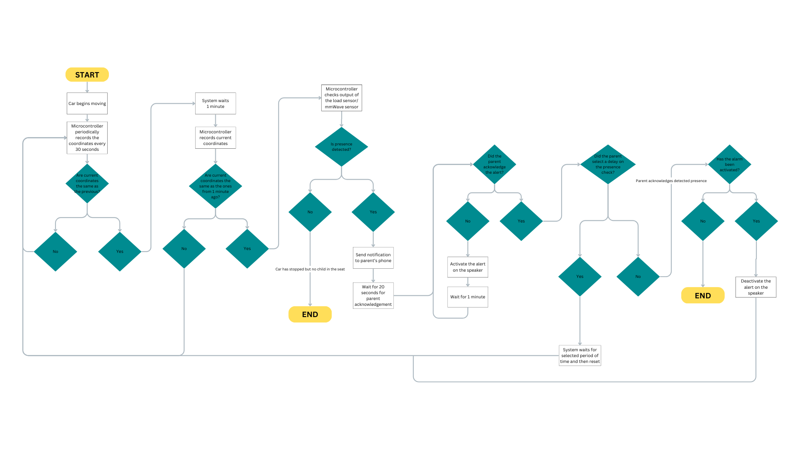

# Smart Child Car Seat Alert System
This project is a low-cost IoT-based system designed to detect a child's presence in a stationary car and trigger alerts through the Blynk application of the parents smartphone as well as through the onboard speaker.

## Hardware Setup
### Components Used

| Component                   | Description                                | Estimated Cost (AUD) |
|----------------------------|--------------------------------------------|-----------------------|
| TTGO T-Beam                | Microcontroller with GPS and Wi-Fi         | $46.00                |
| GPS Module (u-blox NEO-6M) | Monitors vehicle movement and location     | Integrated with TTGO  |
| Thin-Film Pressure Sensor  | Detects child presence based on weight     | $8.90                 |
| Audio Amplifier + Speaker  | Plays audible alert for bystanders         | $11.50                |
| Power Bank                 | Provides independent power                 | $15.00                |
| Breadboard & Jumper Wires  | Prototyping and component connections      | Provided              |

Total Estimated Cost: **$88.80**

Note: Many components were sourced from the UWA Lab or provided by team members at no cost. 

### Wiring Instructions
* Thin-Film Pressure Sensor: Connects to TTGO pin `GPIO 36`, power (+) to 3.3V, ground (-) to ground pin
* Speaker: Connects to TTGO pin `GPIO 13`, power (V) to 5V, ground (G) to ground pin
* Power Supply: Use a 5V USB power bank to power the TTGO T-Beam. This should also power the pressure sensor and the speaker 
* GPS Module: Already integrated into the TTGO T-Beam (no wiring required)


## Software Setup
This system uses two platforms:
1. The **Blynk IoT app** for alerts and sensor dashboard
2. The **Arduino IDE** for firmware programming 

### Required Tools
* [Arduino IDE](https://docs.arduino.cc/software/ide-v2/tutorials/getting-started/ide-v2-downloading-and-installing/)
* [Blynk IoT App](https://blynk.io/)
* Libraries:
    * WiFi.h
    * Time.h
    * Math.h
    * HTTPClient.h
    * HardwareSerial.h
    * driver/ledc.h
    * BlynkSimpleEsp32.h
    * TinyGPSPlus.h

### Setting up the Blynk App
The Blynk project has already been created and configured. 
To use it:
1. Install the [Blynk IoT App](https://blynk.io/) for Android or iOS
2. Log in using the provided account 
3. The dashboard will automatically appear once the app syncs with the device
4. Make sure notifications are enabled in your phone setting for Blynk
---

### Setting up Arduino IDE
1. Install [Arduino IDE](https://docs.arduino.cc/software/ide-v2/tutorials/getting-started/ide-v2-downloading-and-installing/)
2. Install ESP32 Board Support
    * Go to File > Preferences
    * Add this to "Additional Board URLs":
        `https://raw.githubusercontent.com/espressif/arduino-esp32/gh-pages/package_esp32_index.json`
    * Open Board Manager, search for "ESP32", and install it
3. Install Required Libraries
    * Go to Sketch > Include Library > Manage Libraries
    * Search and install:
        * `TinyGPSPlus`
        * `Blynk`

    ESP32-specific headers like `WiFi.h`, `ledc.h`, and `HardwareSerial` are included when you install the **ESP32 board package**.
4. Connect the TTGO T-Beam to your computer
    * Use a USB-C cable
    * Select "ESP32 Dev Module"
    * Set correct COM port
5. Upload Firmware
    * Open `.ino` file
    * Enter your credentials
        ```
        char ssid[] = "Your_WiFi_SSID";
        char pass[] = "Your_WiFi_Password";
        ```
    * Click Upload
    * Open Serial Monitor to verify status

## System Operation
1. Disconnect the system from your computer and instead use the portable power bank
2. Turn on Personal Hotspot on smartphone and wait for system to connect via Wi-Fi. Your smartphone will show when a device has been connected to it. This should approximately take 5 seconds
2. Since the code has already been uploaded, the system should automatically start working

⚠️ Important: After powering on the device, move it outdoors or near a window to allow the GPS module to initialise. This may take up to 1–2 minutes during first use.

### System Flow
1. The load cell sensor and the GPS module should now be online. The sensor monitors the weight; GPS confirms if the vehicle is stationary
2. If >3kg is detected and the vehicle is stationary:
    * **Stage 1:** Smartphone receives a critical alert by Blynk
    * **Stage 2:** If alert is not acknowledged in 20 seconds, onboard speaker activates
3. Alerts reset when weight is removed or vehicle moves

The system flowchart is shown below:


